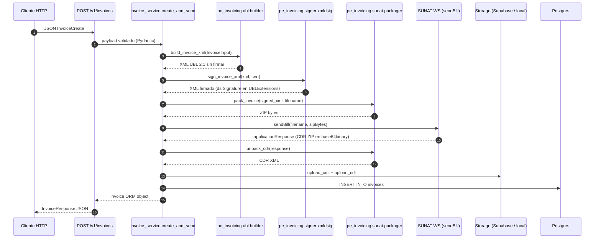

# Arquitectura

Mapa del código del SIS Facturador. El repo es un workspace con dos
paquetes Python independientes:

- **`pe-invoicing`** (`packages/core/`): SDK con la lógica del estándar
  SUNAT. Sin opinión sobre HTTP ni persistencia. Publicable a PyPI.
- **`sis-facturador`** (`packages/api/`): microservicio HTTP que envuelve
  el SDK con FastAPI, persistencia y storage. Es lo que se despliega en
  Vercel.

Lo que sigue describe el modo single-tenant (1 deploy = 1 RUC). El modo
multi-tenant provider está en [`DEPLOY_PROVIDER.md`](./DEPLOY_PROVIDER.md).

## Vista de capas

```
┌────────────────────────────────────────────────────────────┐
│                      HTTP (FastAPI)                         │
│   sis_facturador/main.py · sis_facturador/routers/          │
└─────────────────────────────┬───────────────────────────────┘
                              │
┌─────────────────────────────▼───────────────────────────────┐
│                    Servicio (orquestación)                  │
│   sis_facturador/services/invoice_service.py                │
│   sis_facturador/sunat_runtime.py (caches del SDK)          │
└─┬─────────────┬──────────────┬──────────────┬───────────────┘
  │             │              │              │
  ▼             ▼              ▼              ▼
┌──────────┐ ┌──────────┐ ┌──────────┐ ┌────────────────┐
│  pe_invoi│ │ pe_invoi │ │ pe_invoi │ │  sis_facturador│
│  cing.ubl│ │ cing.    │ │ cing.    │ │  models +      │
│          │ │ signer   │ │ sunat    │ │  storage       │
└──────────┘ └──────────┘ └──────────┘ └────────────────┘
   ↑                                          ↑
   └─── packages/core (SDK) ──────┘  └─ packages/api ─┘
```

## Diagrama de flujo (Mermaid)



## Frontera SDK / servicio

La regla operativa: **el SDK no sabe que existe el servicio**. Concretamente:

- El SDK no importa `fastapi`, `sqlalchemy`, `pydantic-settings` ni ninguna
  cosa del servicio.
- El SDK no lee env vars directamente: recibe todo por parámetros
  (`pfx_base64`, `mode`, `ruc`, `username`, `password`).
- El servicio importa el SDK con `from pe_invoicing import ...` o
  `from pe_invoicing.X import ...` y le pasa los settings que vienen del
  `.env`.

Así, el SDK es testeable sin levantar nada del servicio, y el servicio
puede agregar capas (multi-tenant, auth, rate limit) sin tocar el SDK.

## Módulos del SDK (`packages/core/src/pe_invoicing/`)

### `ubl/`

- `models.py` — dataclasses planos: `Party`, `InvoiceLine`, `InvoiceInput`,
  `InvoiceTotals`. Sin lógica.
- `builder.py` — Toma un `InvoiceInput`, calcula totales (subtotal, IGV
  18%, total), convierte el monto a letras en español, y renderiza la
  plantilla Jinja2.
- `templates/invoice_01.xml.j2` — Plantilla UBL 2.1. **Una sola plantilla
  para Factura y Boleta**: el `cbc:InvoiceTypeCode` se interpola desde
  `inv.tipo_documento` (`"01"` factura, `"03"` boleta).

### `signer/xmldsig.py`

Una sola función pública: `sign_invoice_xml(xml, bundle) -> bytes`. Firma
con XMLDSig RSA-SHA256 + Exclusive C14N y reubica el `<ds:Signature>`
dentro de `cac:UBLExtensions/cac:UBLExtension/cac:ExtensionContent` (donde
SUNAT lo exige).

Detalle profundo en [`SIGNING.md`](./SIGNING.md).

### `sunat/`

- `client.py` — Construye el cliente `zeep` con `build_zeep_client(mode,
  ruc, username, password)` y lo usa para `send_bill(client, zip_bytes,
  filename)`. **El SDK no cachea el cliente**: el caller decide si tiene
  uno global o uno por tenant.
- `packager.py` — `pack_invoice(xml, filename_base)` arma el ZIP que SUNAT
  espera. `unpack_cdr(response)` decodifica el `applicationResponse`.
- `wsdl/{beta,prod}/` — WSDLs descargados una vez y patcheados para que
  las refs internas apunten a los archivos locales (evita el rate-limit de
  SUNAT en `?ns1.wsdl`).

### `security/cert_loader.py`

Funciones puras: `load_cert_from_pfx(pfx_bytes, password)` y
`load_cert_from_base64(pfx_base64, password)`. Devuelven un `CertBundle`
con la RSA private key y el cert X.509 ya en formato PEM listos para
`signxml`. SUNAT solo acepta RSA — si el PFX trae otra cosa, levanta
`ValueError`.

## Módulos del servicio (`packages/api/src/sis_facturador/`)

### `main.py`

Bootstrap de la app FastAPI. Define metadata OpenAPI (title, contact,
license_info, description con links), CORS middleware, exception handler
global, healthchecks (`/v1/health`, `/v1/health/cert`) y monta el router de
`invoices`. El root `/` redirige a `/docs`.

### `config.py`

`Settings` basado en `pydantic-settings`. Lee variables de entorno desde
`.env`. Expone propiedades calculadas: `sunat_wsdl` (apunta a beta o prod
según `MODE`) y `sunat_username` (concatena `RUC + USER` para WS-Security).

### `database.py`

Engine de SQLAlchemy 2.0 con `psycopg` v3. Normaliza el driver en la URL
(acepta `postgresql://` y rewrita a `postgresql+psycopg://`). Usa
`NullPool` en Vercel porque cada invocación es serverless. Expone
`get_db()` como dependency de FastAPI.

### `sunat_runtime.py`

Caches del SDK leyendo del `Settings`. `get_cert()` carga el cert una sola
vez por proceso. `get_sunat_client()` arma el cliente zeep una sola vez.
Para multi-tenant, este archivo es el único que cambia (caches por tenant
en lugar de globales).

### `storage/`

Adaptadores intercambiables. `STORAGE_BACKEND=local` escribe a filesystem
(útil en dev). `STORAGE_BACKEND=supabase` sube al bucket de Supabase
Storage (necesario en Vercel porque el filesystem es efímero).

### `models/invoice.py`

ORM SQLAlchemy de la tabla `invoices`. Guarda: ruc, serie, número, tipo,
totales, status devuelto por SUNAT, code, descripción, URLs del XML
firmado y del CDR, timestamps. La constraint `(ruc, tipo, serie, numero)`
es UNIQUE.

### `schemas/invoice.py`

Pydantic v2 con `Annotated` y `Field`. Valida el payload, separa
`InvoiceCreate` (input) de `InvoiceResponse` (output). Validador custom:
la `serie` debe matchear el `tipo_documento` (factura `F###`, boleta
`B###`).

### `services/invoice_service.py`

La orquestación. `create_and_send(db, payload)` hace:

1. Convierte el `InvoiceCreate` Pydantic a `InvoiceInput` del SDK.
2. Llama al builder, signer, packager (todos del SDK).
3. Construye el cliente zeep cacheado y llama `send_bill`.
4. Sube XML y CDR al storage.
5. Persiste el registro en BD.
6. Devuelve el `Invoice` ORM.

### `routers/invoices.py`

Endpoints REST. Captura excepciones específicas y las traduce a HTTP:

- `IntegrityError` (constraint UNIQUE violado) → 409 Conflict.
- `SunatError` (transport / fault no parseable) → 502 Bad Gateway.

Errores de negocio devueltos por SUNAT con un código numérico (rechazos)
**no** son excepciones — vienen en el `SunatResult` y se persisten con
`status="rejected"`.

## Modelo de tenancy

El servicio actual asume **un solo RUC por deploy**. La identidad del
emisor vive en envs (`SUNAT_RUC`, `SUNAT_USER`, `SUNAT_PASSWORD`,
`CERT_PFX_BASE64`). No hay tabla de tenants ni middleware de resolución.

Para evolucionar a multi-tenant sin romper el modo actual: el plan vive
en [`DEPLOY_PROVIDER.md`](./DEPLOY_PROVIDER.md). Como el SDK ya está
desacoplado, el cambio aterriza solo en `sunat_runtime.py` (caches por
tenant) y en middlewares nuevos del servicio. El SDK no se toca.

## Decisiones de diseño explícitas

**Workspace con dos paquetes en lugar de uno solo.** El SDK
`pe-invoicing` puede vivir su vida en PyPI sin arrastrar FastAPI ni
SQLAlchemy. Un dev que quiera firmar comprobantes desde su propio Django
o lambda hace `pip install pe-invoicing` y listo, sin tocar el servicio.

**Una sola plantilla UBL para factura y boleta.** Considerado dos
plantillas separadas; rechazado porque la única diferencia real es el
`InvoiceTypeCode`. Parametrizar por `tipo_documento` en `InvoiceInput`
mantiene el código DRY.

**WSDLs bundleados localmente.** SUNAT rate-limita el endpoint del import
`?ns1.wsdl`: la primera fetch responde 200, las siguientes 401, y `zeep`
hace varias durante init. Bundlearlos es la práctica estándar.

**El SDK no cachea el cliente zeep ni el cert.** El cache vive en
`sunat_runtime.py` del servicio. Eso permite que el SDK sirva tanto el
caso single-tenant (un cache global) como multi-tenant (un cache por
tenant) sin cambios.

**`signxml` y no implementación propia de XMLDSig.** `signxml` es
mantenido y soporta correctamente la transform `enveloped-signature` con
URI vacío + Exclusive C14N que SUNAT exige. Implementar XMLDSig a mano es
posible pero invita errores sutiles de canonicalización.

**`zeep` y no `requests` con XML armado a mano.** El WSDL de SUNAT tiene
WS-Security con `UsernameToken`, schemas con tipos custom (`xsd:base64Binary`
para el ZIP), y operaciones que devuelven respuestas estructuradas. `zeep`
maneja todo esto.

**`psycopg` v3 (binary). SQLAlchemy 2.0.** Stack actualizado.
`psycopg[binary]` evita compilar contra `libpq` del sistema (importante
en Vercel, que no tiene compilador en runtime).
