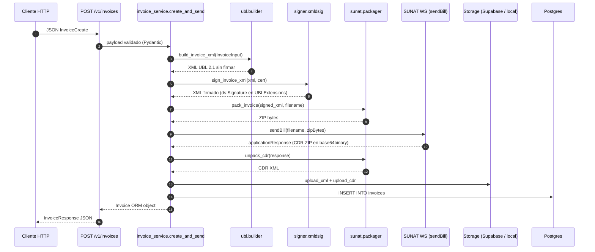

# Arquitectura

Mapa del código del SIS Facturador. Lo que sigue describe el modo
single-tenant (1 deploy = 1 RUC), que es el implementado y validado en
producción. El modo multi-tenant provider está cubierto aparte en
[`DEPLOY_PROVIDER.md`](./DEPLOY_PROVIDER.md).

## Vista de capas

```
┌────────────────────────────────────────────────────────────┐
│                      HTTP (FastAPI)                         │
│   app/main.py · app/routers/invoices.py                     │
└─────────────────────────────┬───────────────────────────────┘
                              │
┌─────────────────────────────▼───────────────────────────────┐
│                    Servicio (orquestación)                  │
│   app/services/invoice_service.py                           │
└─┬─────────────┬──────────────┬──────────────┬───────────────┘
  │             │              │              │
  ▼             ▼              ▼              ▼
┌──────────┐ ┌──────────┐ ┌──────────┐ ┌────────────────┐
│  UBL     │ │  Signer  │ │  SUNAT   │ │  Persistence   │
│ builder  │ │ XMLDSig  │ │  client  │ │  ORM + Storage │
│          │ │          │ │  (zeep)  │ │                │
│ app/ubl/ │ │app/signer│ │app/sunat │ │ app/models/    │
│          │ │          │ │          │ │ app/storage/   │
└──────────┘ └──────────┘ └──────────┘ └────────────────┘
```

## Diagrama de flujo (Mermaid)



## Responsabilidad de cada módulo

### `app/main.py`

Bootstrap de la app FastAPI. Define healthchecks (`/v1/health`,
`/v1/health/cert`), aplica middleware (CORS, manejo global de excepciones) y
monta el router de `invoices`.

### `app/config.py`

`Settings` basado en `pydantic-settings`. Lee variables de entorno desde
`.env`. Expone propiedades calculadas: `sunat_wsdl` (apunta a beta o prod
según `MODE`) y `sunat_username` (concatena `RUC + USER` para
WS-Security).

### `app/database.py`

Engine de SQLAlchemy 2.0 con `psycopg` v3. Normaliza el driver en la URL
(acepta `postgresql://` y rewrita a `postgresql+psycopg://`). Usa `NullPool`
en Vercel porque cada invocación es serverless y no comparte conexiones.
Expone `get_db()` como dependency de FastAPI.

### `app/security/cert_loader.py`

Carga el `.pfx` desde `CERT_PFX_BASE64`, lo decodifica, extrae la RSA private
key y el cert X.509. Verifica que la key sea RSA (SUNAT no acepta otra cosa).
Devuelve un `CertBundle` con la key y el cert ya en formato PEM listos para
`signxml`. Está cacheado con `lru_cache` — el cert se carga una sola vez por
proceso.

### `app/ubl/`

- `models.py` — `dataclass`es planos: `Party`, `InvoiceLine`,
  `InvoiceInput`. Sin lógica.
- `builder.py` — Toma un `InvoiceInput`, calcula totales (subtotal, IGV
  18%, total), convierte el monto a letras en español, y renderiza la
  plantilla Jinja2.
- `templates/invoice_01.xml.j2` — Plantilla UBL 2.1. **Una sola plantilla
  para Factura y Boleta**: el `cbc:InvoiceTypeCode` se interpola desde
  `inv.tipo_documento` (`"01"` para factura, `"03"` para boleta). Esto
  evita duplicar la plantilla — la única diferencia real entre ambos
  comprobantes en el WS sendBill es ese código y la serie.

### `app/signer/xmldsig.py`

Una sola función pública: `sign_invoice_xml(xml, bundle) -> bytes`. Firma
con `signxml.XMLSigner` configurado con:

- `method=enveloped`
- `signature_algorithm="rsa-sha256"`
- `digest_algorithm="sha256"`
- `c14n_algorithm="http://www.w3.org/2001/10/xml-exc-c14n#"`

`signxml` inserta el `ds:Signature` como último hijo del root del documento.
SUNAT exige que viva dentro de
`cac:UBLExtensions/cac:UBLExtension/cac:ExtensionContent`, así que después
de firmar movemos el elemento. La transform `enveloped-signature` hace que
el digest se calcule sin contar la firma misma — funciona aunque la firma
termine fuera del root.

Detalle profundo en [`SIGNING.md`](./SIGNING.md).

### `app/sunat/`

- `client.py` — Cliente `zeep` cacheado en `lru_cache(maxsize=1)`. Usa
  WSDLs locales (no descarga del internet — SUNAT rate-limita el
  `?ns1.wsdl`). Maneja WS-Security con `UsernameToken`. Expone `send_bill`,
  que clasifica la respuesta en `accepted` / `accepted_with_obs` /
  `rejected` y devuelve `SunatResult`.
- `packager.py` — `pack_invoice(xml, filename_base)` crea el ZIP que SUNAT
  espera. `unpack_cdr(response)` decodifica el `applicationResponse` (zeep
  ya lo decodificó de base64 a bytes ZIP — detectamos el magic `PK`).
- `wsdl/{beta,prod}/` — WSDLs descargados una vez y patcheados para que las
  refs internas (`?ns1.wsdl`, `?xsd2.xsd`) apunten a los archivos locales.

### `app/storage/`

Adaptadores intercambiables. `STORAGE_BACKEND=local` escribe a filesystem
(útil en dev). `STORAGE_BACKEND=supabase` sube al bucket de Supabase Storage
(necesario en Vercel porque el filesystem es efímero).

### `app/models/invoice.py`

ORM SQLAlchemy de la tabla `invoices`. Guarda: ruc, serie, número, tipo,
totales, status devuelto por SUNAT, code, descripción, URLs del XML firmado
y del CDR, timestamps. La constraint `(ruc, tipo, serie, numero)` es UNIQUE
— si intentas insertar el mismo comprobante dos veces, el router lo captura
y devuelve 409 Conflict.

### `app/schemas/invoice.py`

Pydantic v2 con `Annotated` y `Field`. Valida strings (regex de RUC, longitud
de razón social, etc.), normaliza decimales, separa `InvoiceCreate` (input)
de `InvoiceResponse` (output con campos calculados como las URLs del
storage).

### `app/services/invoice_service.py`

La orquestación. `create_and_send(db, payload)` hace:

1. Convierte el `InvoiceCreate` Pydantic a `InvoiceInput` dataclass.
2. Llama al builder, signer, packager.
3. Llama a `send_bill` y captura el resultado.
4. Sube XML y CDR al storage.
5. Persiste el registro en BD.
6. Devuelve el `Invoice` ORM.

### `app/routers/invoices.py`

Endpoints REST. Captura excepciones específicas y las traduce a HTTP:

- `IntegrityError` (constraint UNIQUE violado) → 409 Conflict.
- `SunatError` (transport / fault no parseable) → 502 Bad Gateway.

Errores de negocio devueltos por SUNAT con un código numérico (rechazos)
**no** son excepciones — vienen en el `SunatResult` y se persisten con
`status="rejected"`.

## Modelo de tenancy

El código actual asume **un solo RUC por deploy**. La identidad del emisor
vive en envs (`SUNAT_RUC`, `SUNAT_USER`, `SUNAT_PASSWORD`, `CERT_PFX_BASE64`).
No hay tabla de tenants ni middleware de resolución.

Para evolucionar a multi-tenant sin romper el modo actual, el plan
conceptual está en [`DEPLOY_PROVIDER.md`](./DEPLOY_PROVIDER.md). La idea
gruesa es:

- Agregar un middleware opcional (activable por env) que resuelva el tenant
  desde un header `X-Tenant-Id` o un subdominio.
- Reemplazar el `cert_loader` cacheado por uno que cargue por tenant desde
  un vault.
- Activar RLS en Postgres con una columna `tenant_id` en `invoices`.
- Todo regla "cero ramas por modo" — el código actual queda como caso
  particular con `tenant_id` por defecto.

## Decisiones de diseño explícitas

**Una sola plantilla UBL para factura y boleta.** Considerado dos plantillas
separadas (`invoice_01.xml.j2`, `boleta_03.xml.j2`); rechazado porque la
única diferencia real es el `InvoiceTypeCode`. Parametrizar por
`tipo_documento` en `InvoiceInput` mantiene la plantilla DRY y deja el
código del builder agnóstico.

**WSDLs bundleados localmente.** SUNAT rate-limita el endpoint del import
`?ns1.wsdl`: la primera fetch responde 200, las siguientes 401, y `zeep`
hace varias durante init. Bundlearlos es la práctica estándar.

**Cliente zeep cacheado.** `lru_cache(maxsize=1)` en `_get_client()`. La
inicialización del cliente parsea WSDL completo (lento), no lo queremos
hacer por request.

**`signxml` y no `lxml.signature` o implementación propia.** `signxml` es
mantenido y soporta correctamente la transform `enveloped-signature` con
URI vacío + Exclusive C14N que SUNAT exige. Implementar XMLDSig a mano es
posible pero invita errores sutiles de canonicalización.

**`zeep` y no `requests` con XML armado a mano.** El WSDL de SUNAT tiene
WS-Security con `UsernameToken`, schemas con tipos custom (`xsd:base64Binary`
para el ZIP), y operaciones que devuelven respuestas estructuradas. `zeep`
maneja todo esto. Bajar a HTTP plano sería rehacer trabajo gratis.

**`psycopg` v3 (binary). SQLAlchemy 2.0.** Stack actualizado.
`psycopg[binary]` evita compilar contra `libpq` del sistema (importante en
Vercel, que no tiene compilador en runtime).
